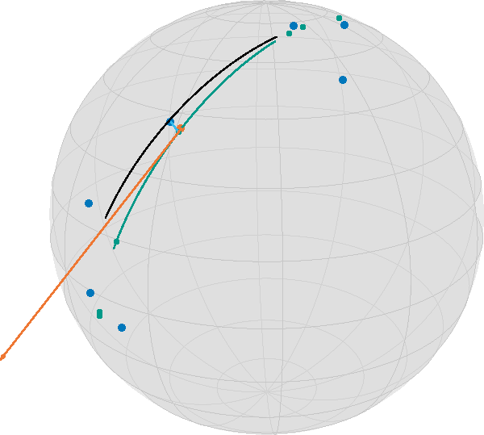

# How to perform Geodesic Regression
Ronny Bergmann

Geodesic regression generalizes [linear regression](https://en.wikipedia.org/wiki/Linear_regression)
to Riemannian manifolds. Let’s first phrase it informally as follows:

> For given data points $d_1,\ldots,d_n$ on a Riemannian manifold $\mathcal M$, find
> the geodesic that “best explains” the data.

The meaning of “best explain” has still to be clarified. We distinguish two cases: time labelled data and unlabelled data

``` julia
    using Manopt, ManifoldDiff, Manifolds, Random, Colors
    using LinearAlgebra: svd
    Random.seed!(42);
```

We use the following data, where we want to highlight one of the points.

``` julia
n = 7
σ = π / 8
S = Sphere(2)
base = 1 / sqrt(2) * [1.0, 0.0, 1.0]
dir = [-0.75, 0.5, 0.75]
data_orig = [exp(S, base, dir, t) for t in range(-0.5, 0.5; length=n)]
# add noise to the points on the geodesic
data = map(p -> exp(S, p, rand(S; vector_at=p, σ=σ)), data_orig)
highlighted = 4;
```


## Time Labeled Data

If for each data item $d_i$ we are also given a time point $t_i\in\mathbb R$, which are pairwise different,
then we can use the least squares error to state the objective function as [Fletcher:2013](@cite)

``` math
F(p,X) = \frac{1}{2}\sum_{i=1}^n d_{\mathcal M}^2(γ_{p,X}(t_i), d_i),
```

where $d_{\mathcal M}$ is the Riemannian distance and $γ_{p,X}$ is the geodesic
with $γ(0) = p$ and $\dot\gamma(0) = X$.

For the real-valued case $\mathcal M = \mathbb R^m$ the solution $(p^*, X^*)$ is given in closed form
as follows: with $d^* = \frac{1}{n}\displaystyle\sum_{i=1}^{n}d_i$ and $t^* = \frac{1}{n}\displaystyle\sum_{i=1}^n t_i$
we get

``` math
 X^* = \frac{\sum_{i=1}^n (d_i-d^*)(t-t^*)}{\sum_{i=1}^n (t_i-t^*)^2}
\quad\text{ and }\quad
p^* = d^* - t^*X^*
```

and hence the linear regression result is the line $γ_{p^*,X^*}(t) = p^* + tX^*$.

On a Riemannian manifold we can phrase this as an optimization problem on the [tangent bundle](https://en.wikipedia.org/wiki/Tangent_bundle),
i.e. the disjoint union of all tangent spaces, as

``` math
\operatorname*{arg\,min}_{(p,X) \in \mathrm{T}\mathcal M} F(p,X)
```

Due to linearity, the gradient of $F(p,X)$ is the sum of the single gradients of

``` math
 \frac{1}{2}d_{\mathcal M}^2\bigl(γ_{p,X}(t_i),d_i\bigr)
 = \frac{1}{2}d_{\mathcal M}^2\bigl(\exp_p(t_iX),d_i\bigr)
 ,\quad i∈\{1,\ldots,n\}
```

which can be computed using a chain rule of the squared distance and the exponential map,
see for example [BergmannGousenbourger:2018](@cite) for details or Equations (7) and (8) of [Fletcher:2013](@cite):

``` julia
M = TangentBundle(S)
struct RegressionCost{T,S}
    data::T
    times::S
end
RegressionCost(data::T, times::S) where {T,S} = RegressionCost{T,S}(data, times)
function (a::RegressionCost)(M, x)
    pts = [geodesic(M.manifold, x[M, :point], x[M, :vector], ti) for ti in a.times]
    return 1 / 2 * sum(distance.(Ref(M.manifold), pts, a.data) .^ 2)
end
struct RegressionGradient!{T,S}
    data::T
    times::S
end
function RegressionGradient!(data::T, times::S) where {T,S}
    return RegressionGradient!{T,S}(data, times)
end
function (a::RegressionGradient!)(M, Y, x)
    pts = [geodesic(M.manifold, x[M, :point], x[M, :vector], ti) for ti in a.times]
    gradients = grad_distance.(Ref(M.manifold), a.data, pts)
    Y[M, :point] .= sum(
        ManifoldDiff.adjoint_differential_exp_basepoint.(
            Ref(M.manifold),
            Ref(x[M, :point]),
            [ti * x[M, :vector] for ti in a.times],
            gradients,
        ),
    )
    Y[M, :vector] .= sum(
        ManifoldDiff.adjoint_differential_exp_argument.(
            Ref(M.manifold),
            Ref(x[M, :point]),
            [ti * x[M, :vector] for ti in a.times],
            gradients,
        ),
    )
    return Y
end
```

For the Euclidean case, the result is given by the first principal component of a principal component analysis,
see [PCR](https://en.wikipedia.org/wiki/Principal_component_regression), i.e. with $p^* = \frac{1}{n}\displaystyle\sum_{i=1}^n d_i$
the direction $X^*$ is obtained by defining the zero mean data matrix

``` math
D = \bigl(d_1-p^*, \ldots, d_n-p^*\bigr) \in \mathbb R^{m,n}
```

and taking $X^*$ as an eigenvector to the largest eigenvalue of $D^{\mathrm{T}}D$.

We can do something similar, when considering the tangent space at the (Riemannian) mean
of the data and then do a PCA on the coordinate coefficients with respect to a basis.

``` julia
m = mean(S, data)
A = hcat(
    map(x -> get_coordinates(S, m, log(S, m, x), DefaultOrthonormalBasis()), data)...
)
pca1 = get_vector(S, m, svd(A).U[:, 1], DefaultOrthonormalBasis())
x0 = ArrayPartition(m, pca1)
```

    ([0.6998621681746481, -0.013681674945026638, 0.7141468737791822], [0.5931302057517893, -0.5459465115717783, -0.5917254139611094])

The optimal “time labels” are then just the projections $t_i = ⟨d_i,X^*⟩$, $i=1,\ldots,n$.

``` julia
t = map(d -> inner(S, m, pca1, log(S, m, d)), data)
```

    7-element Vector{Float64}:
      1.0763904949888323
      0.4594060193318443
     -0.5030195874833682
      0.02135686940521725
     -0.6158692507563633
     -0.24431652575028764
     -0.2259012492666664

And we can call the gradient descent. Note that since `gradF!` works in place of `Y`, we have to set the
`evalutation` type accordingly.

``` julia
y = gradient_descent(
    M,
    RegressionCost(data, t),
    RegressionGradient!(data, t),
    x0;
    evaluation=InplaceEvaluation(),
    stepsize=ArmijoLinesearch(
        M;
        initial_stepsize=1.0,
        contraction_factor=0.990,
        sufficient_decrease=0.05,
        stop_when_stepsize_less=1e-9,
    ),
    stopping_criterion=StopAfterIteration(200) |
                        StopWhenGradientNormLess(1e-8) |
                        StopWhenStepsizeLess(1e-9),
    debug=[:Iteration, " | ", :Cost, "\n", :Stop, 50],
)
```

    Initial  | F(x): 0.142862
    # 50     | F(x): 0.141113
    # 100    | F(x): 0.141113
    # 150    | F(x): 0.141113
    # 200    | F(x): 0.141113
    The algorithm reached its maximal number of iterations (200).

    ([0.7119768725361988, 0.009463059143003981, 0.7021391482357537], [0.590008151835008, -0.5543272518659472, -0.5908038715512287])

For the result, we can generate and plot all involved geodesics

``` julia
dense_t = range(-0.5, 0.5; length=100)
geo = geodesic(S, y[M, :point], y[M, :vector], dense_t)
init_geo = geodesic(S, x0[M, :point], x0[M, :vector], dense_t)
geo_pts = geodesic(S, y[M, :point], y[M, :vector], t)
geo_conn_highlighted = shortest_geodesic(
    S, data[highlighted], geo_pts[highlighted], 0.5 .+ dense_t
);
```


In this image, together with the blue data points, you see the geodesic of the initialization in black
(evaluated on $[-\frac{1}{2},\frac{1}{2}]$),
the final point on the tangent bundle in orange, as well as the resulting regression geodesic in teal,
(on the same interval as the start) as well as small teal points indicating the time points on the geodesic corresponding to the data.
Additionally, a thin blue line indicates the geodesic between a data point and its corresponding data point on the geodesic.
While this would be the closest point in Euclidean space and hence the two directions (along the geodesic vs. to the data point) orthogonal, here we have

``` julia
inner(
    S,
    geo_pts[highlighted],
    log(S, geo_pts[highlighted], geo_pts[highlighted + 1]),
    log(S, geo_pts[highlighted], data[highlighted]),
)
```

    0.002487393068917863

But we also started with one of the best scenarios, i.e. equally spaced points on a geodesic obstructed by noise.

This gets worse if you start with less evenly distributed data

``` julia
data2 = [exp(S, base, dir, t) for t in [-0.5, -0.49, -0.48, 0.1, 0.48, 0.49, 0.5]]
data2 = map(p -> exp(S, p, rand(S; vector_at=p, σ=σ / 2)), data2)
m2 = mean(S, data2)
A2 = hcat(
    map(x -> get_coordinates(S, m, log(S, m, x), DefaultOrthonormalBasis()), data2)...
)
pca2 = get_vector(S, m, svd(A2).U[:, 1], DefaultOrthonormalBasis())
x1 = ArrayPartition(m, pca2)
t2 = map(d -> inner(S, m2, pca2, log(S, m2, d)), data2)
```

    7-element Vector{Float64}:
      0.8226008307680276
      0.470952643700004
      0.7974195537403082
      0.01533949241264346
     -0.6546705405852389
     -0.8913273825362389
     -0.5775954445730889

then we run again

``` julia
y2 = gradient_descent(
    M,
    RegressionCost(data2, t2),
    RegressionGradient!(data2, t2),
    x1;
    evaluation=InplaceEvaluation(),
    stepsize=ArmijoLinesearch(
        M;
        initial_stepsize=1.0,
        contraction_factor=0.990,
        sufficient_decrease=0.05,
        stop_when_stepsize_less=1e-9,
    ),
    stopping_criterion=StopAfterIteration(200) |
                        StopWhenGradientNormLess(1e-8) |
                        StopWhenStepsizeLess(1e-9),
    debug=[:Iteration, " | ", :Cost, "\n", :Stop, 3],
);
```

    Initial  | F(x): 0.089844
    # 3      | F(x): 0.085364
    # 6      | F(x): 0.085364
    # 9      | F(x): 0.085364
    # 12     | F(x): 0.085364
    # 15     | F(x): 0.085364
    # 18     | F(x): 0.085364
    # 21     | F(x): 0.085364
    # 24     | F(x): 0.085364
    # 27     | F(x): 0.085364
    # 30     | F(x): 0.085364
    # 33     | F(x): 0.085364
    # 36     | F(x): 0.085364
    # 39     | F(x): 0.085364
    # 42     | F(x): 0.085364
    # 45     | F(x): 0.085364
    # 48     | F(x): 0.085364
    # 51     | F(x): 0.085364
    # 54     | F(x): 0.085364
    # 57     | F(x): 0.085364
    # 60     | F(x): 0.085364
    # 63     | F(x): 0.085364
    # 66     | F(x): 0.085364
    # 69     | F(x): 0.085364
    # 72     | F(x): 0.085364
    # 75     | F(x): 0.085364
    # 78     | F(x): 0.085364
    # 81     | F(x): 0.085364
    # 84     | F(x): 0.085364
    # 87     | F(x): 0.085364
    # 90     | F(x): 0.085364
    # 93     | F(x): 0.085364
    # 96     | F(x): 0.085364
    # 99     | F(x): 0.085364
    # 102    | F(x): 0.085364
    # 105    | F(x): 0.085364
    # 108    | F(x): 0.085364
    # 111    | F(x): 0.085364
    # 114    | F(x): 0.085364
    # 117    | F(x): 0.085364
    # 120    | F(x): 0.085364
    # 123    | F(x): 0.085364
    # 126    | F(x): 0.085364
    # 129    | F(x): 0.085364
    # 132    | F(x): 0.085364
    # 135    | F(x): 0.085364
    # 138    | F(x): 0.085364
    # 141    | F(x): 0.085364
    # 144    | F(x): 0.085364
    # 147    | F(x): 0.085364
    # 150    | F(x): 0.085364
    # 153    | F(x): 0.085364
    # 156    | F(x): 0.085364
    # 159    | F(x): 0.085364
    # 162    | F(x): 0.085364
    # 165    | F(x): 0.085364
    # 168    | F(x): 0.085364
    # 171    | F(x): 0.085364
    # 174    | F(x): 0.085364
    # 177    | F(x): 0.085364
    # 180    | F(x): 0.085364
    # 183    | F(x): 0.085364
    # 186    | F(x): 0.085364
    # 189    | F(x): 0.085364
    # 192    | F(x): 0.085364
    # 195    | F(x): 0.085364
    # 198    | F(x): 0.085364
    The algorithm reached its maximal number of iterations (200).

For plotting we again generate all data

``` julia
geo2 = geodesic(S, y2[M, :point], y2[M, :vector], dense_t)
init_geo2 = geodesic(S, x1[M, :point], x1[M, :vector], dense_t)
geo_pts2 = geodesic(S, y2[M, :point], y2[M, :vector], t2)
geo_conn_highlighted2 = shortest_geodesic(
    S, data2[highlighted], geo_pts2[highlighted], 0.5 .+ dense_t
);
```



## Unlabeled Data

If we are not given time points $t_i$, then the optimization problem extends – informally speaking –
to also finding the “best fitting” (in the sense of smallest error).
To formalize, the objective function here reads

``` math
F(p, X, t) = \frac{1}{2}\sum_{i=1}^n d_{\mathcal M}^2(γ_{p,X}(t_i), d_i),
```

where $t = (t_1,\ldots,t_n) \in \mathbb R^n$ is now an additional parameter of the objective function.
We write $F_1(p, X)$ to refer to the function on the tangent bundle for fixed values of $t$ (as the one in the last part)
and $F_2(t)$ for the function $F(p, X, t)$ as a function in $t$ with fixed values $(p, X)$.

For the Euclidean case, there is no necessity to optimize with respect to $t$, as we saw
above for the initialization of the fixed time points.

On a Riemannian manifold this can be stated as a problem on the product manifold $\mathcal N = \mathrm{T}\mathcal M \times \mathbb R^n$, i.e.

``` julia
N = M × Euclidean(length(t2))
```

    ProductManifold with 2 submanifolds:
     TangentBundle(Sphere(2, ℝ))
     Euclidean(7; field = ℝ)

``` math
  \operatorname*{arg\,min}_{\bigl((p,X),t\bigr)\in\mathcal N} F(p, X, t).
```

In this tutorial we present an approach to solve this using an alternating gradient descent scheme.
To be precise, we define the cost function now on the product manifold

``` julia
struct RegressionCost2{T}
    data::T
end
RegressionCost2(data::T) where {T} = RegressionCost2{T}(data)
function (a::RegressionCost2)(N, x)
    TM = N[1]
    pts = [
        geodesic(TM.manifold, x[N, 1][TM, :point], x[N, 1][TM, :vector], ti) for
        ti in x[N, 2]
    ]
    return 1 / 2 * sum(distance.(Ref(TM.manifold), pts, a.data) .^ 2)
end
```

The gradient in two parts, namely (a) the same gradient as before w.r.t. $(p,X) ∈ T\mathcal M$,
just now with a fixed `t` in mind for the second component of the product manifold $\mathcal N$

``` julia
struct RegressionGradient2a!{T}
    data::T
end
RegressionGradient2a!(data::T) where {T} = RegressionGradient2a!{T}(data)
function (a::RegressionGradient2a!)(N, Y, x)
    TM = N[1]
    p = x[N, 1]
    pts = [geodesic(TM.manifold, p[TM, :point], p[TM, :vector], ti) for ti in x[N, 2]]
    gradients = Manopt.grad_distance.(Ref(TM.manifold), a.data, pts)
    Y[TM, :point] .= sum(
        ManifoldDiff.adjoint_differential_exp_basepoint.(
            Ref(TM.manifold),
            Ref(p[TM, :point]),
            [ti * p[TM, :vector] for ti in x[N, 2]],
            gradients,
        ),
    )
    Y[TM, :vector] .= sum(
        ManifoldDiff.adjoint_differential_exp_argument.(
            Ref(TM.manifold),
            Ref(p[TM, :point]),
            [ti * p[TM, :vector] for ti in x[N, 2]],
            gradients,
        ),
    )
    return Y
end
```

Finally, we additionally look for a fixed point $x=(p,X) ∈ \mathrm{T}\mathcal M$ at
the gradient with respect to $t∈\mathbb R^n$, i.e. the second component, which is given by

``` math
  (\operatorname{grad}F_2(t))_i
  = - ⟨\dot γ_{p,X}(t_i), \log_{γ_{p,X}(t_i)}d_i⟩_{γ_{p,X}(t_i)}, i = 1, \ldots, n.
```

``` julia
struct RegressionGradient2b!{T}
    data::T
end
RegressionGradient2b!(data::T) where {T} = RegressionGradient2b!{T}(data)
function (a::RegressionGradient2b!)(N, Y, x)
    TM = N[1]
    p = x[N, 1]
    pts = [geodesic(TM.manifold, p[TM, :point], p[TM, :vector], ti) for ti in x[N, 2]]
    logs = log.(Ref(TM.manifold), pts, a.data)
    pt = map(
        d -> vector_transport_to(TM.manifold, p[TM, :point], p[TM, :vector], d), pts
    )
    Y .= -inner.(Ref(TM.manifold), pts, logs, pt)
    return Y
end
```

We can reuse the computed initial values from before, just that now we are on a product manifold

``` julia
x2 = ArrayPartition(x1, t2)
F3 = RegressionCost2(data2)
gradF3_vector = [RegressionGradient2a!(data2), RegressionGradient2b!(data2)];
```

and we run the algorithm

``` julia
y3 = alternating_gradient_descent(
    N,
    F3,
    gradF3_vector,
    x2;
    evaluation=InplaceEvaluation(),
    debug=[:Iteration, " | ", :Cost, "\n", :Stop, 50],
    stepsize=ArmijoLinesearch(
        M;
        contraction_factor=0.999,
        sufficient_decrease=0.066,
        stop_when_stepsize_less=1e-11,
        retraction_method=ProductRetraction(SasakiRetraction(2), ExponentialRetraction()),
    ),
    inner_iterations=1,
)
```

    Initial  | F(x): 0.089844
    # 50     | F(x): 0.091097
    # 100    | F(x): 0.091097
    The algorithm reached its maximal number of iterations (100).

    (ArrayPartition{Float64, Tuple{Vector{Float64}, Vector{Float64}}}(([0.750222090700214, 0.031464227399200885, 0.6604368380243274], [0.6636489079535082, -0.3497538263293046, -0.737208025444054])), [0.7965909273713889, 0.43402264218923514, 0.755822122896529, 0.001059348203453764, -0.6421135044471217, -0.8635572995105818, -0.5546338813212247])

which we render can collect into an image creating the geodesics again

``` julia
geo3 = geodesic(S, y3[N, 1][M, :point], y3[N, 1][M, :vector], dense_t)
init_geo3 = geodesic(S, x1[M, :point], x1[M, :vector], dense_t)
geo_pts3 = geodesic(S, y3[N, 1][M, :point], y3[N, 1][M, :vector], y3[N, 2])
t3 = y3[N, 2]
geo_conns = shortest_geodesic.(Ref(S), data2, geo_pts3, Ref(0.5 .+ 4*dense_t));
```

which yields


Note that the geodesics from the data to the regression geodesic meet at a nearly orthogonal angle.

**Acknowledgement.** Parts of this tutorial are based on the bachelor thesis of
[Jeremias Arf](https://orcid.org/0000-0003-3765-0130).

## Literature

```@bibliography
Pages = ["GeodesicRegression.md"]
Canonical=false
```
